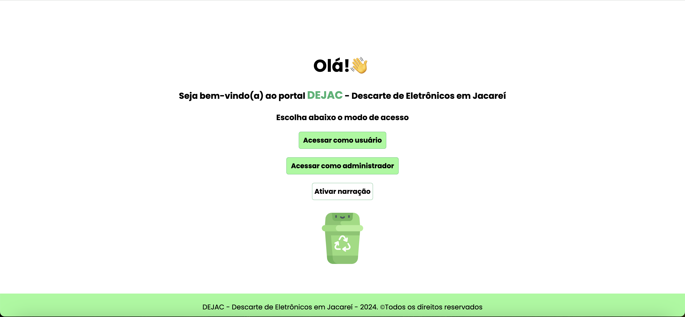
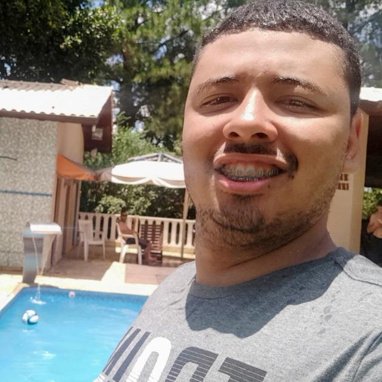
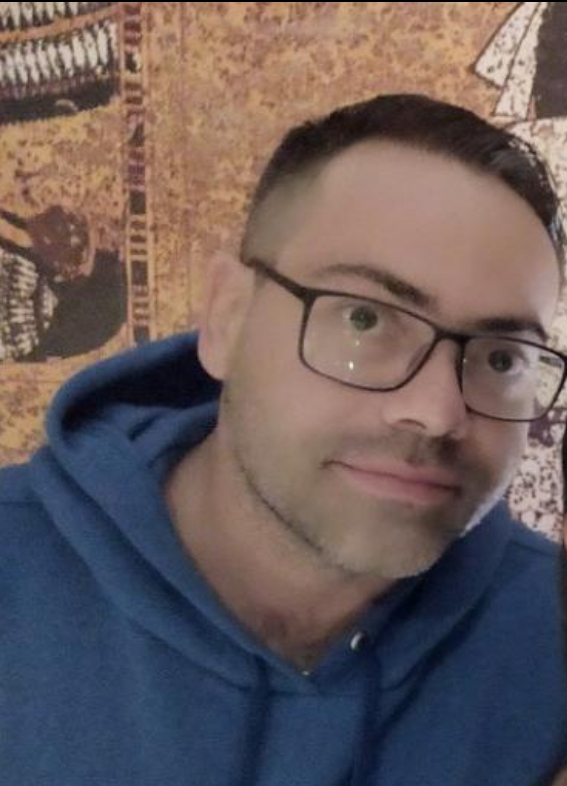

**DEJAC - Descarte de Eletrônicos em Jacareí**

**Objetivo**

A aplicação DEJAC - Descarte de Eletrônicos em Jacareí é um projeto que utiliza diversas tecnologias para apresentar dados referentes a locais de entrega voluntária de materiais eletrônicos em Jacareí.

Ao acessar a aplicação, é possível obter informações relacionadas ao endereço, telefone e email dos locais, de forma a obter mais detalhes sobre o serviço de coleta e reciclagem, bem como realizar o agendamento da entrega e saber quais produtos podem ou não ser encaminhados para os pontos de entrega.

**Tecnologias**

Linguagem de desenvolvimento: JavaScript / TypeScript
Linguagem de marcação e estilização: HTML, CSS
Banco de Dados - Firebase Database (Nuvem)
Utilização da API dos correios: `https://viacep.com.br/ws/${cep}/json/`
Acessibilidade: narração dos textos da tela inicial, com a utilização do recurso speakText
Controle de versão: Git/Github

**Ferramenta de desenvolvimento**

Visual Studio Code (VS Code)

**Como executar o projeto**

- Criar uma pasta para o projeto
- Abrir o VSCODE, clicar em "Abrir Pasta" e localizar a pasta criada. Abrir um terminal e executar o comando: `git clone git@github.com:isaias30silva/Univesp_DejacB.git`
- Executar o comando `npm install`
- Executar o comando `npm install firebase`
- Executar o comando `npm install firebase-admin`
- Para rodar o projeto, executar o comando `npm start`
- Se tudo estiver funcionando corretamente, o back-end estará rodando na URL: [http://localhost:8800/](http://localhost:8800/) e apresentará a mensagem "Servidor está funcionando!"

Com o funcionamento do backend, o próximo passo será baixar o projeto frontend, disponível em:  
`git@github.com:isaias30silva/Univesp_Dejac.git`

**Equipe de desenvolvimento**

<table>
  <tr>
    <td align="center">
      
      
Bruno Gabriel

    </td>
    <td align="center">
      
      
Bruno Malvão

    </td>
    <td align="center">
      
      
Denise

    </td>
    <td align="center">
      
      
Isaias

    </td>
    <td align="center">
      
      
Rodrigo

    </td>
    <td align="center">
      
      
Rodolfo

    </td>
  </tr>
</table>

